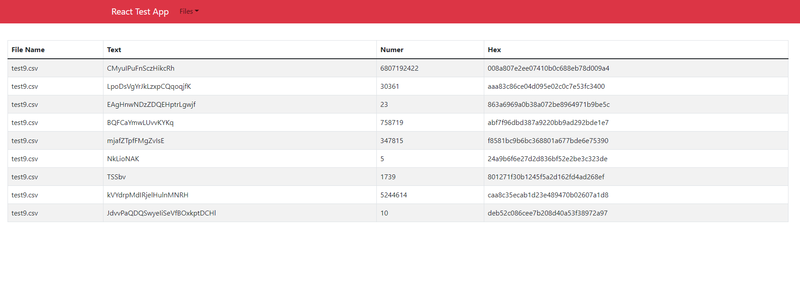
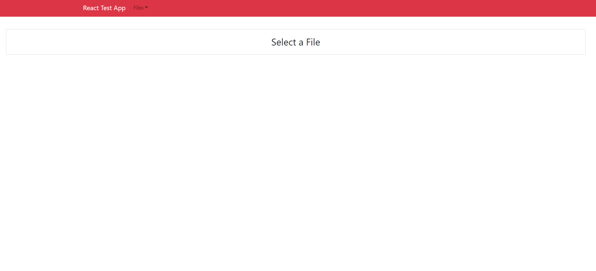
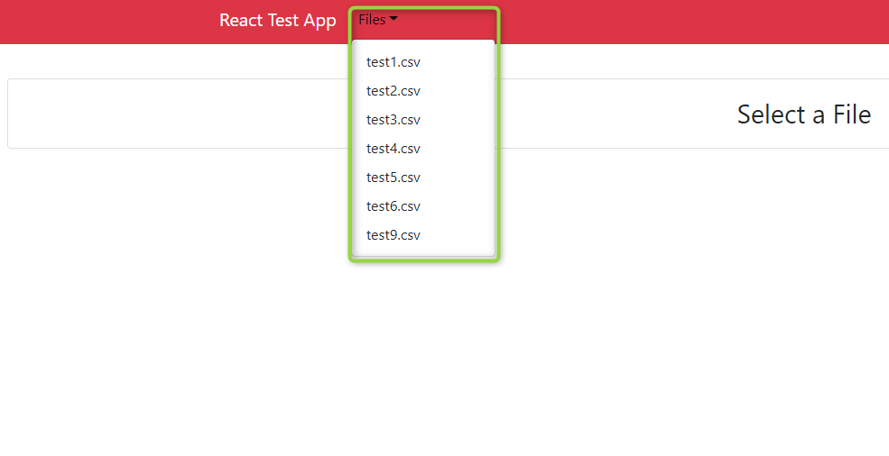
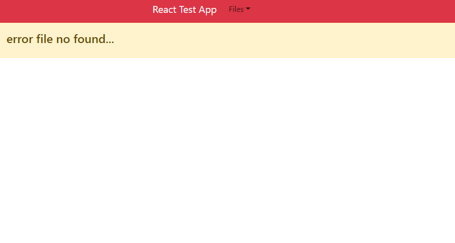

# Getting Started with Create React App

## Available Scripts

In the project directory, run this scripts for start the App :

1. Clone the project:
Back-End:
```terminal
git clone https://github.com/geovannyC/server-toolbox-app.git
```
Front-End:
```terminal
git clone https://github.com/geovannyC/front-toolbox-app.git
```

2. Install dependences :
`NAVIGATE TO SERVER DIRECTORY cd server-toolbox-app`
```terminal
cd server-toolbox-app
```
   `INSTALL DEPENCENCES`
```terminal
npm install
```
3. Install dependences :
`NAVIGATE TO FRONT DIRECTORY cd front-toolbox-app`
```terminal
cd front-toolbox-app
```
   `INSTALL DEPENCENCES`
```terminal
npm install
```
4. Launch the project:
`SERVER FOLDER`
   `START`
```terminal
npm start
```
`FRONT FOLDER`
   `START`
```terminal
npm start
```

Runs the app in the development mode.\
Open [http://localhost:3000](http://localhost:3000) to view it in your browser.

5. Launcher the test runner:
`SERVER FOLDER`
   `START`
```terminal
npm run test
```
`FRONT FOLDER`
   `START`
```terminal
npm run test
```

- [**evidence**](evidence)
- [**public**](public)
- [**src**](src)
    - [**actions**](src/actions)
    - [**components**](src/components)
        - [**content**](src/components/content)
            - [**status**](src/components/content/status)
            - [**table**](src/components/content/table)
        - [**home**](src/components/home)
            - [**controller**](src/components/home/controller)
        - [**nav**](src/components/nav)
            - [**controller**](src/components/nav/controller)
    - [**reducer**](src/reducer)
    - [**until**](src/until)


     
<div align="center">
	<h1 >Result App</h1>
		
</div>
<div align="center">
	<h2 >Home</h2>
		
</div>
<div align="center">
	<h2 >List Files</h2>
		
</div>
<div align="center">
	<h2 >If the file is empty or got a 404 error</h2>
		
</div>
<div align="center">
	<h2 >Result if the file isn't empty</h2>
		
</div>
